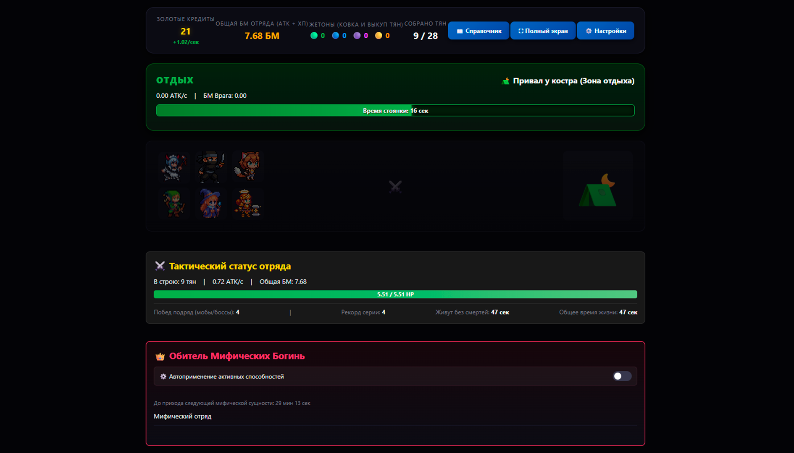
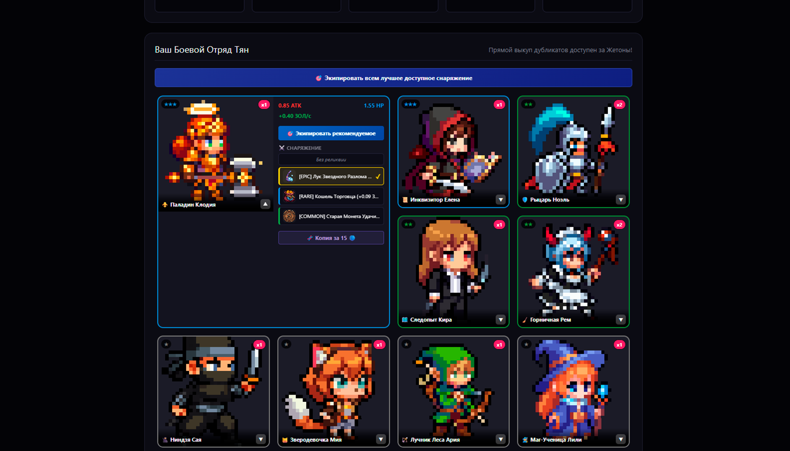
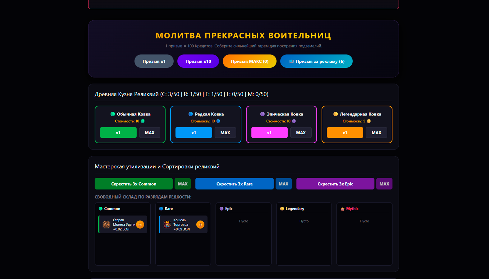

<div align="center">


<br><br>


# Fantasy Waifu Arena

**Idle-RPG с элементами гача: собирайте отряд героинь, куйте снаряжение и покоряйте бесконечное подземелье.**

[](https://yandex.ru/games)
[](#-локализация)
[](#-технологии)

[Играть](#) · [Особенности](#-особенности) · [Скриншоты](#-скриншоты) · [Установка](#-локальный-запуск) · [SDK](#-интеграция-с-yandex-games-sdk)

</div>

---

## 📖 О проекте

**Fantasy Waifu Arena** — браузерная idle-RPG для платформы **Yandex Игры**. Отряд героинь сражается автоматически, пока игрок развивает его между боями: призывает новых воительниц через гача-баннер, куёт и улучшает снаряжение, охотится за мифическими артефактами и собирает серии побед над бесконечно нарастающими по силе противниками и боссами.

Игра написана на чистом **HTML / CSS / JavaScript** без сборщиков и фреймворков — весь код умещается в три файла и запускается прямо в браузере.

## ✨ Особенности

- ⚔️ **28 уникальных героинь** — 23 обычные (1★–5★) + 5 мифических, каждая со своей пассивной или активной способностью
- 🎰 **Gacha-призыв** — x1 / x10 / MAX, плюс бесплатный призыв за просмотр рекламы
- 🛠️ **Кузня и Мастерская реликвий** — ковка снаряжения по редкости, объединение дубликатов в более редкий тир
- 👑 **Мифические богини** — появляются раз в 30 минут, у части есть активные способности с перезарядкой (аннигиляция врага, гарантированный лут)
- 🏟️ **Визуальная арена** — отряд и противник анимированно сражаются в реальном времени, с ротацией состава на экране
- 🌍 **Локализация RU / EN** — с ручным переключателем и автоопределением языка платформы через Yandex Games SDK
- ☁️ **Облачные сохранения** — прогресс синхронизируется между устройствами через `player.getData()` / `player.setData()`
- 📺 **Интеграция рекламы** — полноэкранная реклама раз в 5 минут (с паузой игры на время показа) + rewarded-реклама за бонусный призыв
- ⏸️ **Полная поддержка паузы платформы** — игра корректно останавливается по `game_api_pause` / `game_api_resume`
- 🖥️ **Fullscreen-режим** — через `ysdk.screen.fullscreen`

## 🖼️ Скриншоты

<div align="center">
<table>
<tr>
<td></td>
<td></td>
<td></td>
</tr>
<tr>
<td align="center"><sub>Интерфейс</sub></td>
<td align="center"><sub>Персонажи</sub></td>
<td align="center"><sub>Призыв героинь</sub></td>
</tr>
</table>
</div>

## 🚀 Локальный запуск

Проект не требует сборки — достаточно любого статического сервера (открыть `index.html` напрямую через `file://` тоже работает, но часть функций Yandex SDK при этом недоступна, так как SDK не грузится не с домена Яндекса).

```bash
git clone https://github.com/resassance/afk-gacha.git
cd <репозиторий>

# любой простой статический сервер, например:
npx serve .
# или
python3 -m http.server 8000
```

Затем откройте `http://localhost:8000` (или порт, который выведет команда) в браузере.

> Вне платформы Yandex Games SDK не инициализируется (`YaGames` не определён) — игра автоматически переключается на локальный `localStorage` вместо облачных сохранений, реклама и SDK-события просто не срабатывают. Это ожидаемое поведение для локальной разработки.

## 📁 Структура проекта

```
.
├── index.html      # разметка страницы, все текстовые data-i18n атрибуты
├── style.css       # все стили, включая анимации арены и адаптивность
├── script.js       # игровая логика, база героинь/снаряжения, SDK-интеграция, i18n
├── promo           # баннер и лого 
├── assets/
    ├── characters
    ├── gears
    └── mobs
└── screenshots
    ├── desktop
    └── mobile
```

## 🎮 Интеграция с Yandex Games SDK

| Функциональность | Статус | Реализация |
|---|:---:|---|
| Инициализация SDK | ✅ | `YaGames.init()` + `LoadingAPI.ready()` |
| Автоопределение языка | ✅ | `ysdk.environment.i18n.lang`, читается на **каждом** запуске |
| Облачные сохранения | ✅ | `ysdk.getPlayer({ scopes:false })` → `getData()` / `setData()` (debounce 4с + флаш перед закрытием) |
| Полноэкранная реклама | ✅ | `ysdk.adv.showFullscreenAdv`, раз в 5 минут, с полной заморозкой игры |
| Rewarded-реклама | ✅ | `ysdk.adv.showRewardedVideo` — бонусный призыв героинь |
| Fullscreen | ✅ | `ysdk.screen.fullscreen` |
| Пауза платформы | ✅ | `game_api_pause` / `game_api_resume` |

## 🌍 Локализация

Переключатель языка находится в **⚙️ Настройки → Язык / Language**. Поддерживаются русский и английский; при первом запуске на платформе Yandex Игры язык подхватывается автоматически из окружения SDK, а ручной выбор игрока имеет приоритет над автоопределением при последующих запусках.

## 🛠️ Технологии

- Vanilla **HTML5 / CSS3 / JavaScript** (ES2020+), без зависимостей и сборщиков
- [Yandex Games SDK v2](https://yandex.ru/dev/games/doc/ru/)
- Хранение прогресса: `localStorage` (локально) + Yandex Player Data API (облако)

## 📄 Лицензия

_All Rights Reserved_

## 🙏 Благодарности

Сделано для платформы [Яндекс Игры](https://yandex.ru/games).